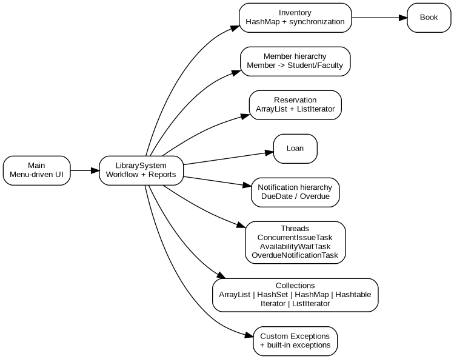
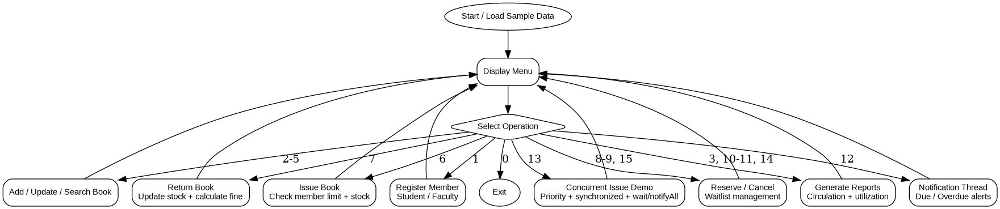

# SMART LIBRARY MANAGEMENT, BOOK RESERVATION AND OVERDUE NOTIFICATION SYSTEM USING JAVA

## Complete Assignment Report

**Department:** Department of Computer Science and Engineering  
**Programme:** ______________________________  
**Course Code & Course Name:** CSA09 – Programming in Java (SLOT A)  
**Academic Year / Batch:** ______________________________  
**Faculty Name:** ______________________________  
**Assignment Title:** Smart Library Management, Book Reservation and Overdue Notification System using Java  
**Date of Issue:** ______________________________  
**Date of Submission:** ______________________________  
**Maximum Marks:** 100  
**Course Outcomes:** CO1, CO2, CO3  
**Bloom's Taxonomy:** L2 – Understand; L3 – Apply; L4 – Analyse  
**SDG Mapping:** SDG 4 – Quality Education; SDG 9 – Industry, Innovation and Infrastructure; SDG 16 – Peace, Justice and Strong Institutions  
**Industry / Societal Relevance:** Digital library circulation, resource tracking, reservation management, automated notifications, data consistency and reliable concurrent transaction processing.

> **Source basis:** This report follows the supplied Common Course Assignment Format and the supplied CSA09 assignment question. The assignment specifically requires OOP, collections, generics/iterators, exception handling, multithreading, synchronization, inter-thread communication, a menu-driven interface and circulation/inventory reporting.

---

## 1. Problem Statement and Problem Formulation

### 1.1 Problem Statement

Design, implement and evaluate a menu-driven Java application for a Smart Library Management, Book Reservation and Overdue Notification System. The system must register members and books, display available copies, issue and return books, search and update records, maintain a reservation waitlist for unavailable books, generate circulation/fine and inventory-utilization reports, and produce due-date/overdue notifications.

The solution must model core entities such as `Member`, `Book`, `Reservation`, `Inventory` and `Notification` using encapsulated classes. Inheritance and polymorphism are required so that membership-specific borrowing limits, fine calculation or notification behaviour can vary at run time. Java Collection Framework classes such as `ArrayList`, `Set`, `HashMap` and `Hashtable` must be used with generics and `Iterator`/`ListIterator`. Built-in and user-defined exceptions must handle invalid member IDs, duplicate reservations, unavailable books and invalid input. Multithreading must simulate concurrent issue and notification tasks using thread priorities, synchronization and inter-thread communication while keeping shared inventory/reservation data consistent.

### 1.2 Problem Formulation

**Inputs**
- Member ID, name, email and membership type.
- Book ID, title, author, category and total copies.
- Issue, return, reservation and cancellation requests.
- Search/update keywords and record values.
- Date used for due/overdue evaluation.

**Processing**
1. Validate member and book identifiers.
2. Maintain member and book records in collections.
3. Check membership borrowing limits.
4. Atomically update available book copies during issue/return operations.
5. Maintain reservation waitlists for unavailable books.
6. Calculate overdue fines according to membership type.
7. Generate due-date and overdue notifications.
8. Execute concurrent issue tasks safely using synchronized methods.
9. Use `wait()`/`notifyAll()` to demonstrate inter-thread communication for inventory availability.
10. Produce circulation and inventory-utilization reports.

**Outputs**
- Member and inventory listings.
- Search/update results.
- Issue/return confirmation and due dates.
- Reservation queue and duplicate-reservation error messages.
- Fine amounts.
- Due-date/overdue notifications.
- Circulation report.
- Inventory-utilization report.
- Execution evidence and test results.

### 1.3 Scope

The project is a console-based academic prototype. It focuses on the Java programming concepts explicitly required by the assignment rather than database persistence, authentication, web deployment or external messaging services.

---

## 2. Objective and Expected Outcomes

### 2.1 Objectives

1. Apply object-oriented programming to a realistic library workflow.
2. Demonstrate encapsulation, data hiding, inheritance and runtime polymorphism.
3. Use Java collections, generics and iterators for record management.
4. Implement robust exception handling for invalid and conflicting operations.
5. Demonstrate multithreading, thread priority, synchronization and inter-thread communication.
6. Provide a clean menu-driven interface for core library operations.
7. Generate meaningful circulation, fine, notification and inventory-utilization outputs.
8. Validate correctness through planned test cases and execution evidence.

### 2.2 Expected Outcomes

- Library members and books can be registered and managed.
- Available copies are tracked accurately.
- Borrowing limits differ between Student and Faculty members through polymorphism.
- Reservations are maintained for unavailable books and duplicate reservations are rejected.
- Overdue fines are calculated using the member-specific fine rate.
- Due-date and overdue notifications are generated.
- Concurrent issue requests do not cause negative or inconsistent stock.
- Reports provide evidence for circulation and inventory utilization.

---

## 3. Requirements, Constraints and Assumptions

### 3.1 Functional Requirements

| ID | Requirement |
|---|---|
| FR1 | Register Student and Faculty members. |
| FR2 | Add and update book records. |
| FR3 | Display inventory and available copies. |
| FR4 | Search books by ID, title, author or category. |
| FR5 | Issue books subject to membership limits and stock. |
| FR6 | Return books and calculate overdue fines. |
| FR7 | Reserve unavailable books and maintain a waitlist. |
| FR8 | Cancel reservations and reject duplicate reservations. |
| FR9 | Generate due-date and overdue notifications. |
| FR10 | Generate circulation and inventory-utilization reports. |
| FR11 | Demonstrate concurrent issue processing. |
| FR12 | Handle invalid input without terminating the application. |

### 3.2 Non-Functional Requirements

- **Correctness:** Stock and member borrowing records must remain consistent.
- **Reliability:** Exceptional operations should produce controlled error messages.
- **Usability:** Operations should be accessible through a simple numbered menu.
- **Maintainability:** Classes should have focused responsibilities.
- **Performance:** Collection-based lookup and in-memory processing should be responsive for the assignment-scale dataset.
- **Safety:** Shared inventory updates must be synchronized.
- **Privacy:** The prototype uses sample data only and does not transmit personal information to external services.

### 3.3 Constraints

- Console-based Java application.
- In-memory data; no external database is required.
- JDK 17+ recommended.
- The implementation is designed for the assignment-scale dataset.
- Notification delivery is simulated using console output.
- Thread priorities are hints to the JVM scheduler and are not treated as strict execution-order guarantees.

### 3.4 Assumptions

- A book ID uniquely identifies a book record.
- Member IDs are unique.
- A Student member may borrow up to 3 books; a Faculty member may borrow up to 5 books.
- Student fine rate is Rs. 2/day and Faculty fine rate is Rs. 3/day for this prototype.
- Standard loan duration is 14 days.
- Reservations are allowed only when no copy is currently available.
- The sample execution date is 2026-09-01.

---

## 4. Application of Relevant Course Knowledge / Concepts

The supplied assignment maps the project to CO1, CO2 and CO3. The implementation deliberately demonstrates the required Java concepts.

| Course concept | Application in project |
|---|---|
| Classes and objects | `Member`, `Book`, `Reservation`, `Loan`, `Inventory`, `LibrarySystem`, notification and thread classes. |
| Encapsulation / data hiding | Fields are private; state is accessed through methods. |
| Inheritance | `StudentMember` and `FacultyMember` extend `Member`; `DueDateNotification` and `OverdueNotification` extend `Notification`. |
| Polymorphism | `Member` references invoke overridden borrowing limit, fine-rate and membership-type methods at runtime. Notification references invoke different `send()` implementations. |
| ArrayList | Members, loans and reservations are stored in lists. |
| Set / HashSet | Unique member objects are maintained in a `HashSet`. |
| HashMap | Member lookup and inventory storage use `HashMap`. |
| Hashtable | Notification log uses `Hashtable`. |
| Generics | Collections are declared with parameterized types such as `List<Member>` and `Map<String, Book>`. |
| Iterator | Book search traverses an iterator. |
| ListIterator | Reservation cancellation uses `ListIterator.remove()`. |
| Exception handling | Built-in exceptions plus `InvalidMemberException`, `DuplicateReservationException`, `BookUnavailableException` and `InvalidInputException`. |
| Multithreading | Concurrent issue tasks, notification task and availability waiting task extend `Thread`. |
| Thread priority | Issue tasks use maximum and normal priorities; notification uses minimum priority. |
| Synchronization | Inventory and library state-changing methods are synchronized. |
| Inter-thread communication | `wait()` and `notifyAll()` coordinate availability waiting and book return. |
| Control structures | Menu `switch`, validation, loops and conditional logic control the workflow. |

### 4.1 Fine Calculation Model

For a returned loan:

**Overdue days** = `max(0, return date − due date)`

**Fine** = `Overdue days × member fine per day`

Example from the execution: M001 is a Student member with a due date of 2026-09-15 and returns B101 on 2026-09-17. Therefore:

`Fine = 2 days × Rs. 2/day = Rs. 4.00`

### 4.2 Inventory Utilization Model

**Utilization (%)** = `((Total Copies − Available Copies) / Total Copies) × 100`

This metric is reported per book and for the complete inventory.

---

## 5. Design / Proposed Solution / Methodology

### 5.1 High-Level Architecture

The system follows a layered, object-oriented console architecture:

**Main UI → LibrarySystem → Inventory / Member / Reservation / Loan / Notification → Thread Tasks and Reports**

The `Main` class accepts menu input. `LibrarySystem` coordinates business operations. `Inventory` owns book stock and synchronizes stock-changing operations. Member and notification hierarchies demonstrate inheritance and polymorphism. Thread classes simulate concurrent tasks.



### 5.2 Major Classes and Responsibilities

| Class | Responsibility |
|---|---|
| `Member` | Common member state and borrowing behaviour contract. |
| `StudentMember` | Student borrowing limit and fine rate. |
| `FacultyMember` | Faculty borrowing limit and fine rate. |
| `Book` | Book metadata and synchronized stock operations. |
| `Reservation` | Reservation identity, member/book association and timestamp. |
| `Loan` | Issue date, due date and return state. |
| `Inventory` | Book storage and synchronized stock management. |
| `Notification` | Abstract notification contract. |
| `DueDateNotification` | Due-date reminder implementation. |
| `OverdueNotification` | Overdue alert implementation. |
| `LibrarySystem` | Central workflow, collections, reports and validation. |
| `ConcurrentIssueTask` | Concurrent issue request. |
| `AvailabilityWaitTask` | Waits for inventory availability and demonstrates `wait()`. |
| `OverdueNotificationTask` | Runs notification processing in a separate thread. |
| `Main` | Menu-driven console interface and sample-data initialization. |

### 5.3 Data Structures

- `ArrayList<Member>` – ordered member records.
- `HashSet<Member>` – uniqueness and set traversal.
- `HashMap<String, Member>` – fast member lookup by ID.
- `HashMap<String, Book>` – inventory lookup by book ID.
- `Hashtable<String, String>` – synchronized notification log.
- `ArrayList<Reservation>` – reservation waitlist.
- `ArrayList<Loan>` – circulation records.

### 5.4 Concurrency Design

The critical shared resource is book stock. If two threads attempt to issue the last available copy simultaneously, an unsynchronized implementation could allow both operations to observe the same stock state. The final solution prevents this by synchronizing issue/return operations at the library/inventory level and synchronizing book stock updates.

The execution also includes an availability-waiting thread. It waits while B102 has no available copy. When the main workflow returns the book, `notifyAll()` is called and the waiting thread resumes. This provides observable evidence of inter-thread communication.

### 5.5 Flowchart



---

## 6. Algorithm / Pseudocode / Flowchart

### 6.1 Main Algorithm

```text
START
Load sample members and books
REPEAT
    Display menu
    Read user choice

    IF choice = Register Member
        Validate input
        Create StudentMember or FacultyMember
        Store member in ArrayList, HashSet and HashMap

    ELSE IF choice = Add/Update/Search Book
        Validate book data
        Add/update record or traverse inventory using Iterator

    ELSE IF choice = Issue Book
        Validate member
        Check borrowing limit
        Check available copy
        Synchronize inventory update
        Create Loan with 14-day due date
        Add book to member's borrowed list

    ELSE IF choice = Return Book
        Find active loan
        Calculate overdue days and fine
        Mark loan returned
        Increase inventory stock
        notifyAll waiting threads

    ELSE IF choice = Reserve Book
        Validate member and book
        IF available copies > 0
            Reject reservation because reservation is unnecessary
        ELSE IF same member/book reservation exists
            Raise DuplicateReservationException
        ELSE
            Add Reservation to waitlist

    ELSE IF choice = Cancel Reservation
        Traverse reservations with ListIterator
        Remove matching reservation

    ELSE IF choice = Notifications
        Traverse active loans
        Generate due-date or overdue Notification polymorphically

    ELSE IF choice = Concurrent Demo
        Start two concurrent issue threads
        Join both threads
        Start availability-waiting thread
        Return the active copy
        notifyAll waiting thread
        Join waiting thread

    ELSE IF choice = Reports
        Generate circulation and utilization outputs

    ELSE IF choice = Exit
        STOP LOOP

    Catch and report invalid input or custom exceptions
UNTIL Exit
PRINT termination message
END
```

### 6.2 Issue Book Pseudocode

```text
FUNCTION issueBook(memberId, bookId)
    find member
    IF member does not exist
        throw InvalidMemberException
    IF member already borrowed book
        throw InvalidInputException
    IF borrowed count >= member borrowing limit
        throw InvalidInputException
    synchronize inventory
        IF no copy is available
            throw BookUnavailableException
        decrease available copies
    create Loan(issueDate, issueDate + 14 days)
    add loan to circulation list
    add book to member borrowed list
    remove matching reservation if present
    RETURN loan
END FUNCTION
```

### 6.3 Reservation Pseudocode

```text
FUNCTION reserveBook(memberId, bookId)
    validate member
    validate book
    IF available copies > 0
        throw BookUnavailableException("reservation not required")
    FOR each reservation
        IF same memberId and bookId
            throw DuplicateReservationException
    END FOR
    add new reservation to waitlist
END FUNCTION
```

### 6.4 Notification Pseudocode

```text
FUNCTION sendNotifications(today)
    FOR each active loan
        daysToDue = dueDate - today
        IF daysToDue = 3
            create DueDateNotification
            send notification
        ELSE IF daysToDue < 0
            create OverdueNotification
            send notification
    END FOR
END FUNCTION
```

---

## 7. Implementation / Source Code and Environment / Tools Used

### 7.1 Environment

| Item | Used in project |
|---|---|
| Language | Java |
| Recommended JDK | JDK 17 or later |
| Tested environment | OpenJDK 21 |
| Interface | Console / command line |
| Editor/IDE compatibility | VS Code, IntelliJ IDEA, Eclipse or any Java-compatible editor |
| Build method | `javac` command |
| Execution method | `java` command |
| Diagram tool | Graphviz |
| Documentation | Markdown; DOCX and PDF versions included |
| Version-control deliverable | GitHub-ready repository structure and README |

### 7.2 Compilation and Execution

From the project root:

```text
javac -d out src/*.java
java -cp out Main
```

The source code is supplied as individual `.java` files in the `src/` directory. The complete source listing is also provided separately in `docs/source_code_listing.txt`.

### 7.3 Source Files

1. `Main.java`
2. `LibrarySystem.java`
3. `Inventory.java`
4. `Member.java`
5. `StudentMember.java`
6. `FacultyMember.java`
7. `Book.java`
8. `Loan` (inside `LibrarySystem.java`)
9. `Reservation.java`
10. `Notification.java`
11. `DueDateNotification.java`
12. `OverdueNotification.java`
13. `ConcurrentIssueTask.java`
14. `AvailabilityWaitTask.java`
15. `OverdueNotificationTask.java`
16. `LibraryExceptions.java`

### 7.4 Modern Tool Evidence

The project was compiled and executed successfully. Graphviz was used to generate the architecture and flowchart diagrams. Execution output and screenshots are included in the project package.

---

## 8. Test Cases and Expected / Actual Results

| Test ID | Test case | Expected result | Actual result | Status |
|---|---|---|---|---|
| TC01 | Display inventory | All sample books and available copies displayed. | All five sample books displayed with correct stock. | PASS |
| TC02 | Search `Java` | Java Programming record displayed. | B101 displayed. | PASS |
| TC03 | Issue B101 to M001 | Issue succeeds and due date is generated. | Issued successfully; due date 2026-09-15. | PASS |
| TC04 | Due-date notification | Reminder appears three days before due date. | `[DUE-DATE]` notification displayed for M001/B101. | PASS |
| TC05 | Overdue return | Fine is calculated from overdue days and membership rate. | B101 returned on 2026-09-17; Rs. 4.00 fine. | PASS |
| TC06 | Reserve unavailable B102 | Reservation added to waitlist. | R1001 added for M003/B102. | PASS |
| TC07 | Duplicate reservation | Duplicate request rejected without crash. | `Duplicate reservation is not allowed.` | PASS |
| TC08 | Update B103 | Book record is updated and searchable. | B103 title updated and search returned updated record. | PASS |
| TC09 | Invalid member | Custom exception handled and program continues. | Invalid member message displayed; menu continued. | PASS |
| TC10 | Concurrent issue of one-copy B102 | One request succeeds; another is rejected; stock never becomes negative. | One task succeeded, one rejected, stock remained consistent. | PASS |
| TC11 | Inter-thread communication | Waiting task blocks and resumes after return/notification. | `ReservationWaitTask` waited and resumed after `notifyAll()`. | PASS |
| TC12 | Utilization report | Per-book and overall utilization displayed. | Report generated; final overall utilization 0.00% after all demo loans were returned. | PASS |

Detailed CSV test data and actual execution logs are included in `data/test_cases.csv` and `output/`.

---

## 9. Execution Screenshots / Outputs

The following execution evidence is included in the package:

1. **01_inventory_search.png** – inventory display and Java book search.
2. **02_reservation_fine.png** – issue, due notification, return and fine calculation.
3. **03_concurrency_reports.png** – member/circulation output, concurrent issue test, utilization and reservation queue.
4. **04_exception_handling.png** – invalid member, unnecessary reservation, missing reservation and duplicate-book validation.
5. **execution_output.txt** – complete scripted console execution log.
6. **error_handling_output.txt** – exception-handling execution log.

The screenshots are direct renderings of the console output produced by the supplied Java program.

---

## 10. Results and Validation

### 10.1 Functional Validation Summary

| Requirement area | Validation evidence | Result |
|---|---|---|
| Member management | Registration + member listing | Satisfied |
| Book management | Add/update/search/display | Satisfied |
| Inventory accuracy | Concurrent one-copy issue | Satisfied |
| Borrowing limits | Membership-specific limits in superclass contract | Satisfied |
| Reservation | Waitlist + duplicate prevention | Satisfied |
| Fine calculation | Formula-based overdue calculation | Satisfied |
| Notifications | Due/overdue polymorphic notification classes | Satisfied |
| Exception handling | Invalid input and conflict tests | Satisfied |
| Multithreading | Concurrent issue + waiting task | Satisfied |
| Reporting | Circulation + utilization reports | Satisfied |

### 10.2 Concurrency Observation

For B102, the initial inventory contains one copy. Two issue threads request the same book. The execution shows:

- `IssueTask-M001` with priority 10: **SUCCESS**.
- `IssueTask-M002` with priority 5: **REJECTED – No available copy**.
- No negative stock occurs.
- `ReservationWaitTask` waits for B102 availability.
- The main thread returns B102 and calls `notifyAll()`.
- `ReservationWaitTask` resumes.

This validates synchronized access to the shared inventory and demonstrates inter-thread communication.

### 10.3 Fine Validation

For M001:

| Parameter | Value |
|---|---:|
| Membership | Student |
| Fine rate | Rs. 2/day |
| Due date | 2026-09-15 |
| Return date | 2026-09-17 |
| Overdue days | 2 |
| Calculated fine | Rs. 4.00 |
| Program output | Rs. 4.00 |
| Validation | PASS |

### 10.4 Inventory Utilization Observation

The final scripted run returns all demonstration loans before the utilization report. Therefore, all five books show 0% utilization at that point and the overall utilization is 0.00%. This is an expected result of the test sequence rather than a performance defect.

---

## 11. Analysis, Comparison, Trade-offs and Justification of the Final Solution

### 11.1 Alternative Approaches Considered

| Approach | Advantages | Limitations | Decision |
|---|---|---|---|
| Simple arrays | Easy for very small datasets. | Fixed size, weak lookup support, less suitable for required Collection Framework concepts. | Not selected |
| Single `ArrayList` for everything | Simple implementation. | Searching and uniqueness checks require more manual processing; does not demonstrate required map/set structures well. | Not selected |
| Collection-based in-memory design | Flexible size, fast keyed lookup, uniqueness support and direct alignment with CO2. | Uses multiple structures and requires synchronization for shared state. | **Selected** |
| Database-backed design | Persistent and scalable. | Adds database configuration and moves focus away from the Java collection/threading requirements. | Outside current scope |

### 11.2 Key Trade-offs

**In-memory collections vs persistence:** In-memory storage is simpler and directly demonstrates Java collections, but records disappear when the program exits. A database would improve persistence but increase setup complexity.

**Console notifications vs external messaging:** Console notifications are deterministic and suitable for academic validation. Email/SMS integration would be more realistic but would require external services and credentials.

**Synchronized methods vs finer-grained locking:** Synchronization at the service/inventory level is easier to reason about for this assignment-scale system. Fine-grained locks could increase concurrency but also increase complexity.

**Thread priority:** Priorities are included because they are explicitly required, but they are not relied on for correctness. Correctness comes from synchronization and validation.

**Single-process concurrency vs distributed concurrency:** Java threads are sufficient to demonstrate race-condition control within one JVM. A production library would require transaction control across multiple application instances.

### 11.3 Justification of Final Solution

The final solution was selected because it satisfies the explicit assignment requirements while keeping the design understandable and runnable without external infrastructure. It provides concrete evidence for CO1 through class hierarchies and polymorphism, CO2 through collections/generics/iterators, and CO3 through exceptions and multithreading with synchronization and `wait()`/`notifyAll()`.

---

## 12. Broader Considerations / SDG Relevance

### SDG 4 – Quality Education

A smart library system supports educational access by making learning resources easier to discover, borrow and reserve. Automated due reminders can also reduce missed returns and improve availability of shared academic resources.

### SDG 9 – Industry, Innovation and Infrastructure

The project demonstrates software engineering concepts used in digital resource-management systems: object-oriented modelling, collection-based data management, concurrent transaction processing and automated reporting.

### SDG 16 – Peace, Justice and Strong Institutions

Reliable circulation records, controlled access to shared resources, clear exception handling and consistent inventory state support transparent and accountable institutional processes.

### Ethical, Privacy and Professional Considerations

The prototype uses sample member information and does not transmit data externally. A production implementation should apply authentication, authorization, secure storage, audit logging, data minimization and appropriate privacy controls. Concurrency correctness is also an ethical/reliability concern because incorrect stock information can unfairly deny resources or create duplicate allocations.

### Accessibility and Usability

The current console interface is intentionally simple. A future user-facing version should support accessible web/mobile interfaces, clear error messages, keyboard navigation, screen-reader compatibility and multilingual support where required.

---

## 13. Conclusion, Limitations and Possible Improvements

### 13.1 Conclusion

The Smart Library Management, Book Reservation and Overdue Notification System successfully implements the core requirements of the CSA09 assignment. The solution combines OOP, inheritance, polymorphism, Java Collection Framework classes, generics, iterators, exception handling and multithreading in one integrated application. Testing demonstrates successful issue/return processing, reservation control, fine calculation, notifications, exception recovery and synchronized concurrent inventory handling.

### 13.2 Limitations

1. Data is stored only in memory.
2. Notification delivery is simulated on the console.
3. There is no user authentication or role-based access control.
4. The prototype is not a web or mobile application.
5. The reporting layer is text-based rather than a graphical dashboard.
6. Thread priority cannot guarantee exact execution order.
7. The project is designed for assignment-scale data rather than large production datasets.

### 13.3 Possible Improvements

- Add MySQL or another persistent database using JDBC.
- Add login, authentication and role-based authorization.
- Persist members, books, loans and reservations across sessions.
- Implement automatic reservation fulfilment when a book is returned.
- Add scheduled notification services and email/SMS integration.
- Add a web/mobile user interface.
- Add structured logging and audit trails.
- Add JUnit automated tests and code-coverage measurement.
- Improve search using indexing or a database query layer.
- Add configurable loan duration and fine policies.

---

## 14. Individual Contribution of Group Members

The supplied assignment requires active participation by all members and a clearly specified individual contribution. The team details were not present in the supplied assignment question, so the table below is intentionally left for the team to complete rather than inventing personal information.

| Reg. No. | Name | Responsibility | Percentage of Contribution |
|---|---|---|---:|
| __________________ | __________________ | Problem analysis, design and documentation | ____% |
| __________________ | __________________ | Java implementation, OOP and collections | ____% |
| __________________ | __________________ | Testing, concurrency validation and results | ____% |
| **Total** |  |  | **100%** |

For a two-member team, remove the third row and make the two percentages total 100%.

---

## 15. One-Page Individual Reflection

> **Use one copy of this page for each group member.** Replace the placeholders with the member's own details and personal experience. The assignment instructions specifically require each member to submit an individual reflection covering design/development decisions, challenges, learning, SDG connection and mapped CO attainment.

### Individual Reflection – Member: __________________

**Reg. No.:** __________________  
**Name:** __________________

This assignment gave me an opportunity to apply Java concepts to a realistic Smart Library Management problem rather than using the concepts only in isolated programs. My main contribution was ________________________________________________. During development, I worked with ________________________________________________ and learned how different Java classes can cooperate to implement a complete workflow.

One important design decision was to model members using inheritance. The `Member` abstraction provides common data and operations, while `StudentMember` and `FacultyMember` override borrowing limits and fine rates. This helped me understand runtime polymorphism in a practical context. I also learned why encapsulation is important when managing library records because direct access to internal state could make validation and consistency difficult.

Another major learning outcome was the use of the Java Collection Framework. The project uses `ArrayList`, `HashSet`, `HashMap` and `Hashtable`, together with `Iterator` and `ListIterator`. Before this assignment, I understood these structures individually; while implementing the project, I learned how to select a collection based on the required operation, such as keyed lookup, uniqueness or sequential traversal.

The most challenging part was concurrent inventory processing. Two threads can request the same last available copy, so the program must protect the shared stock state. I learned that thread priority alone cannot guarantee correctness. Synchronization is required to prevent inconsistent updates, while `wait()` and `notifyAll()` can coordinate threads when a resource becomes available. Testing this behaviour improved my understanding of multithreaded Java programming.

The assignment also strengthened my exception-handling skills. Instead of allowing invalid member IDs, duplicate reservations or unavailable books to terminate the application, the program reports the problem and returns to the menu. This made the system more robust and closer to how a real application should behave.

The project is relevant to **SDG 4 – Quality Education** because a well-managed library improves access to educational resources. It also relates to **SDG 9 – Industry, Innovation and Infrastructure** through software-based resource management and **SDG 16 – Peace, Justice and Strong Institutions** through reliable and accountable institutional records.

If I had additional time and resources, I would improve the system by adding persistent database storage, authentication, a web interface, automatic reservation fulfilment and real notification services. These improvements would make the prototype more suitable for real-world deployment while retaining the Java concepts demonstrated in this assignment.

Overall, the assignment helped me attain **CO1** by applying OOP and polymorphism, **CO2** by using collections, generics and iterators, and **CO3** by applying exception handling and multithreading. The biggest lesson I gained was how individual Java concepts combine to solve a complete software problem with functional, reliability and concurrency requirements.

**Student Signature:** __________________________    **Date:** __________________

---

## 16. References

1. Supplied assignment question: *Smart Library Management, Book Reservation and Overdue Notification System using Java*, CSA09 – Programming in Java (SLOT A).
2. Supplied document: *Common Course Assignment Format*.
3. Oracle Java Platform documentation for Java language and standard library concepts used by the implementation: classes, collections, iterators, exceptions and threads.
4. Java Development Kit (JDK) / OpenJDK documentation and runtime used for compilation and execution.
5. Graphviz documentation/software used to create the architecture and flowchart diagrams.
6. No external dataset is required; the project uses the sample data listed in `data/sample_data.txt`.
7. AI-assisted development/documentation, where applicable, should be acknowledged according to the institution's academic-integrity policy. The supplied source code and test evidence should be reviewed by the student team before submission.

---

## Appendix A – Deliverables Checklist

| Deliverable | Included in ZIP |
|---|---|
| Complete assignment report | `docs/Smart_Library_Assignment_Report.docx` and `.pdf` |
| Problem statement/formulation | Report Section 1 |
| Objectives/outcomes | Report Section 2 |
| Requirements/constraints/assumptions | Report Section 3 |
| Course concepts | Report Section 4 |
| Proposed solution/methodology | Report Section 5 |
| Algorithm/pseudocode | `docs/pseudocode.md` and report Section 6 |
| Flowchart | `docs/flowchart.png` |
| Source code | `src/` |
| Environment/tools | Report Section 7 |
| Test cases | `data/test_cases.csv` and report Section 8 |
| Execution outputs | `output/` |
| Execution screenshots | `screenshots/` |
| Results/validation | Report Section 10 |
| Analysis/comparison/trade-offs | Report Section 11 |
| SDG/broader considerations | Report Section 12 |
| Conclusion/limitations/improvements | Report Section 13 |
| Individual contribution | Report Section 14 |
| Individual reflection | Report Section 15 + template file |
| References | Report Section 16 |
| GitHub-ready files | `README.md`, source, docs, data, outputs |

## Appendix B – CO / Bloom / Assessment Alignment

The supplied assignment identifies CO1, CO2 and CO3 and Bloom levels L2, L3 and L4. The common format lists problem formulation, application of knowledge, implementation, tool usage, validation, analysis, broader considerations and documentation/reflection as assessment components. Exact PO mapping is faculty-specific in the supplied format and is therefore left to the faculty/team rather than inventing PO numbers.

| Assessment component | Relevant CO | Bloom level from supplied format |
|---|---|---|
| Problem formulation | CO1/CO2/CO3 as applicable | L3/L4 |
| Application of knowledge | CO1/CO2/CO3 | L3/L4 |
| Solution / implementation | CO1/CO2/CO3 | L4/L5/L6 |
| Modern tool usage | CO2/CO3 | L3/L4 |
| Validation | CO2/CO3 | L4/L5 |
| Analysis & justification | CO1/CO2/CO3 | L4/L5 |
| Broader considerations | CO1/CO2/CO3 | L4/L5 |
| Documentation & reflection | CO1/CO2/CO3 | L3/L4 |

